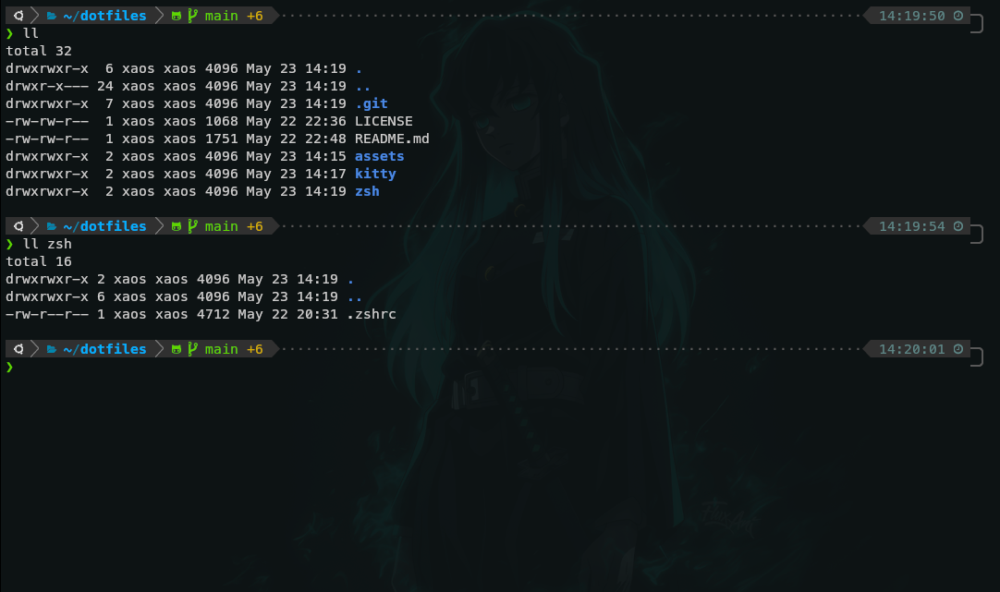

# mz-dotfiles

 
 
 
 

This are my personal dotfiles I use to configure [kitty](https://sw.kovidgoyal.net/kitty/) terminal and the [zsh](https://www.zsh.org/) shell. This repo is primarily used to transfer this files to my other PCs. The wallpaper, which shines through the slightly transparent terminal window, can be found [here](https://4kwallpapers.com/black-dark/muichiro-tokito-22499.html).

  

## 💡 Getting started
### Prerequisites
- [zsh](https://www.zsh.org/) must be installed
    - please run `zsh --version` to confirm
    - expected result: `zsh 5.0.8` or more recent
- [zsh](https://www.zsh.org/) should be set as default shell
    - run `echo $SHELL`from a new terminal window
    - expected result `/usr/bin/zsh`or similar
    - to check which shells are available on your system, use `cat /etc/shells`
    - to make zsh your default shell, use `chsh` (without parameters), `chsh -s /usr/bin/zsh`, `chsh -s $(which zsh)` or on Fedora use `sudo chsh $USER` or `sudo usermod -s /bin/zsh $USER` (Fedora needs `sudo` because of security restrictions)
- [kitty](https://sw.kovidgoyal.net/kitty/) must be installed
    - install it as described on the website
### Additional
For best use of my [zsh] and [kitty] dotfiles/config-files the following tools are recommended:
- [oh my zsh](https://github.com/ohmyzsh/ohmyzsh) for managing the [zsh] configuration
- [powerlevel10k](https://github.com/romkatv/powerlevel10k) as nice [zsh] theme
- do not forget to install some [Nerd-Fonts](https://github.com/ryanoasis/nerd-fonts/releases/tag/v3.4.0) like Meslo (as used in my config). The user fonts are usually stored under `~/.local/share/fonts` or system wide `/usr/share/fonts/` or `/usr/local/share/fonts/`.

## 💾 Installation
To install all the tools, follow the instructions on the responsible websites (see links above).
After that, replace the dotfiles/config-files with the ones from this repository.

>[!WARNING]
>Before you replace your dot- and config-files, please make sure you have a backup copy of your own files. The author is not liable for corrupted configurations!

- replace `~/.zshrc` with the one from this repo
- replace `~/.config/kitty/kitty.conf` and `~/.config/kitty/current-theme.conf` with the ones from the repo
>[!NOTE] 
>You can also follow the instructions from the tools like [zsh], [kitty], [oh my zsh] and [powerlevel10k] to make your own config.

## 📑 License
This project is released under the terms of the MIT license. The MIT license allows users to use, copy, modify and distribute the source code of the project with certain restrictions and requirements. For more information, please refer to the license file included with this project or visit https://opensource.org/licenses/MIT.
